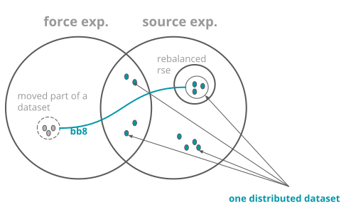
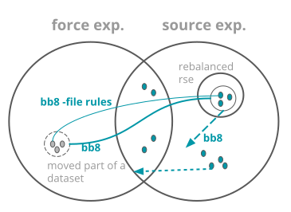
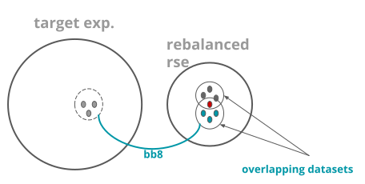
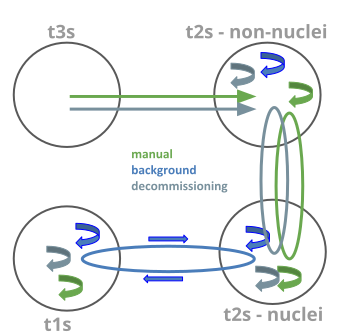

Daemon rucio-bb8
****************
.. argparse::
   :filename: bin/rucio-bb8
   :func: get_parser
   :prog: rucio-bb8

Force expression - ideal case
-----------------------------
--force-expression option of bb8 defines a set of rses where the rebalanced data will be sent. It can be one rse or group of rses. Complicated case is when we intend to rebalance distributed dataset, of which only part is present at rebalanced rse. Than only that part will be rebalanced elsewhere and the rest of the distributed dataset stays at its current locations.

Use case:

- all t1s are full and we need to free one of them forcing the destination as t2 nuclei, example:

- rucio-bb8 INFN-T1_DATADISK 50000000000000 --force-expression ‘tier=2&datapolicy=Nucleus’

- we run decommissioning e.g. LOCALGROUPDISK of a site, and we need to specify dst LOCALGROUPDISK where to move the remaining data

Force expression - feasible alternative
---------------------------------------
The schema on previous slide is not feasible, because:

1) new_exp = force_exp // rebalanced_rse
   could trigger unwanted transfers of files in distributed datasets, (dotted line) DANGEROUS!

2) new_exp = (force_exp & source_exp) // rebalanced_rse
   can trigger transfers to source_exp (dashed line), instead of wished force_exp.

Solution for near future:

- rules on files with Express activity would be created, so that rebalanced files are qucikly moved to force_exp (bb8-file rules)

- the main rule for rebalancing with new_exp is created with certain delay, so that express rules will manage to be finished.

Overlapping datasets
--------------------
A dataset can be partly composed of files from different dataset. If such a dataset is rebalanced, only the part unique for the dataset is physically  moved. Original rule behind this dataset seems to be fully rebalanced, but few files are not moved and thus the final counting of rebalanced bytes doesn’t need to be accurate. Target expression can be both site or set of sites, and it can be forced, or chosen by bb8.

Rebalancing modes - selection of destination rses
-------------------------------------------------
Rebalancing is running in free different modes marked with different color on the left schema. This represents rebalancing only when --force-expression is not used, and only if rse is of type DATADISK. For LOCALGROUPDISKS, --force-expression should be used, in order to use the other proper LOCALGROUPDISK.

Automatic rebalancing
---------------------
Currently two separated groups:

1) nuclei = (t1s + some t2s)

2) t2s non-nulcei

ratio = primaries / total_space
Not-rebalanced src candidates (red in the schema):

1) rebalancing is already ongoing, or not finished

2) rse is too small

3) rse is blacklisted

4) rse is excluded from rebalancing

Same for destinations.

.. image:: ../images/bb8_5.svg
   :height: 500px
