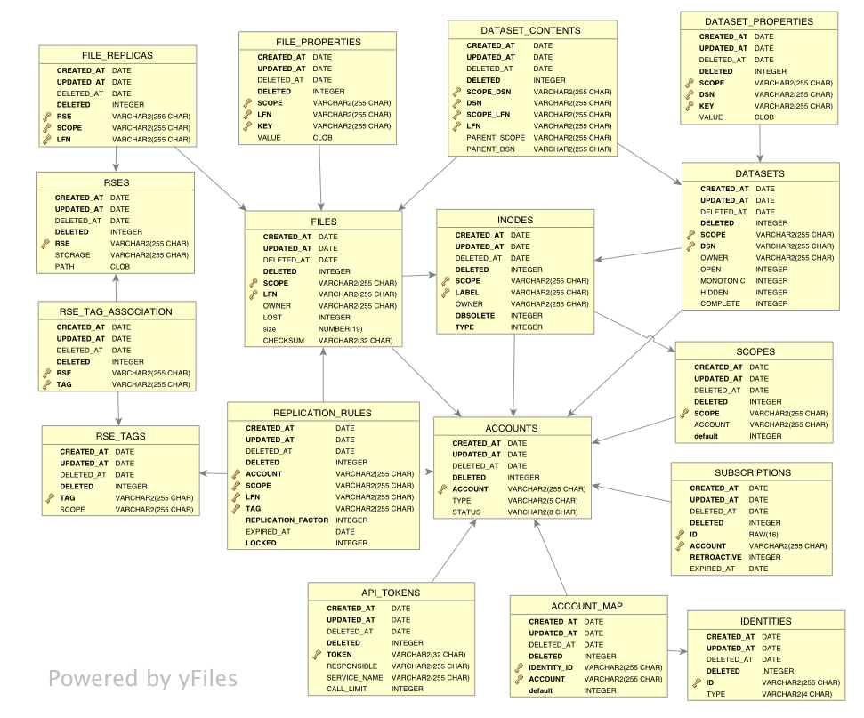

Rucio Database Schema
=====================

This figure describes the database schema including the relationships between the tables, the available 
indexes and primary keys, and the identifiers tracked by the database. 

