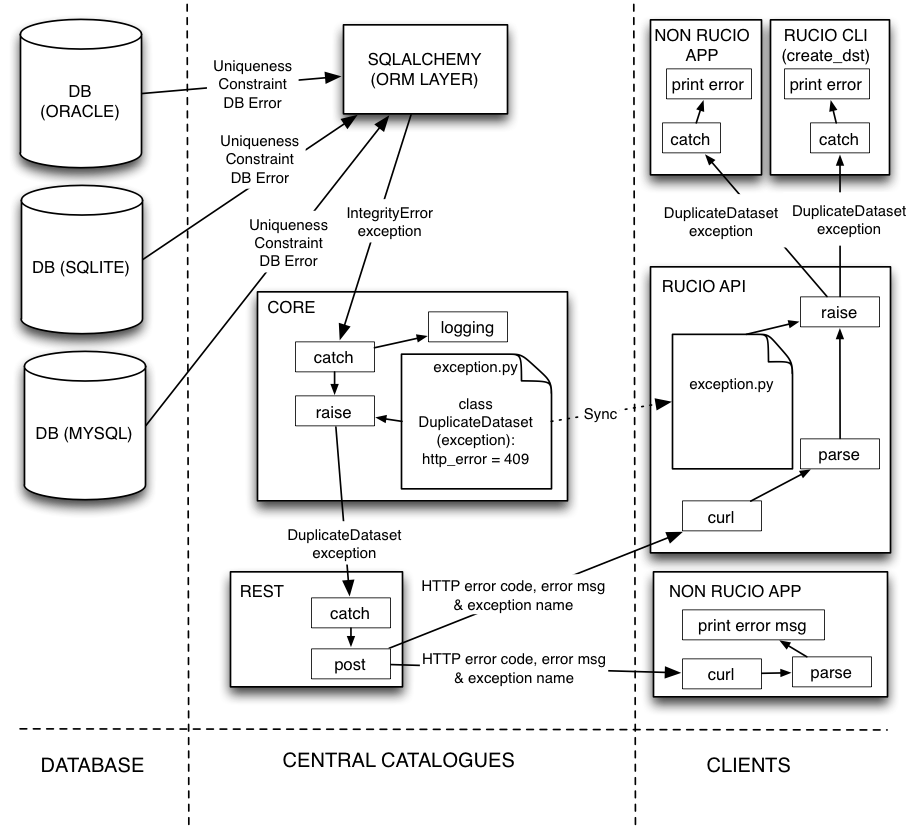

----------------------------
Exception and error handling
----------------------------

***************************
Exception Handling in Rucio
***************************

In Rucio, state is kept at the database level. Consequently many exceptions originate from the ORM layer. These exceptions will be caught at the CORE layer, and translated into meaningful Rucio exceptions.

In the case where REST processes catch a Rucio exception, they will communicate to the client the HTTP error code, the name of the exception, and the corresponding error string. The reason for sending the name of the exception is that HTTP error codes can map to multiple exceptions, and consequently client code cannot use the HTTP error code to ascertain the type of exception that occurred.

To make the error response both readable by humans querying the system directly and also parsable for the Rucio client API the error information will be sent both as a string and also as a dictionary in the response header. The error string contains the exception class and a human readable error message separated by a colon. The HTTP response header has to mandatory fields "ExceptionClass" and "ExceptionMessage". The will be used by the Rucio client API to raise the correct exception on the client side. If needed the headers can be extended to give further details about the error.

This process is summarised in the following diagram.

