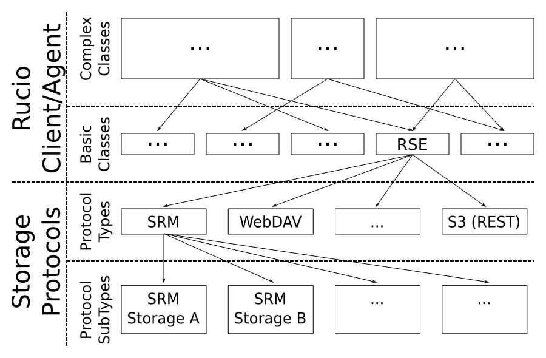
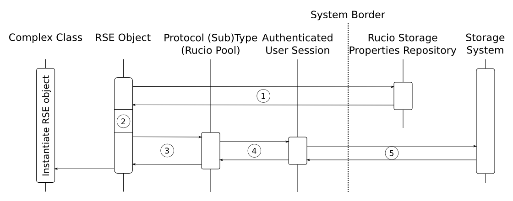
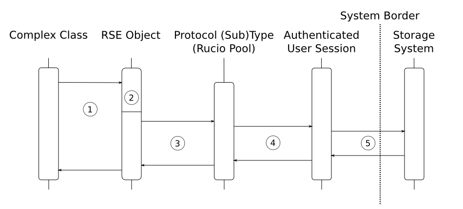

-----------------------------------------
Rucio Storage Element Wrapper and Manager
-----------------------------------------

**DRAFT VERSION: WORK IN PROGRESS**

Rucio Storage Elements (RSE) are container for physical files. They are
designed to provide a way to define each storage and all its supported
protocols separately and include them in a transparent way for users and
developers. Doing so creates the flexibility to add new storages and protocols
to the system without changing other classes using RSEs. It further allows for
separate update strategies for each storage, as all information needed to
interact with a specific storage is gathered at runtime (Rucio Storage Element
Properties (RSEProperties) and Rucio Storage Element Protocol Type
(RSEProtocol)).

********
Overview
********

Architectural Overview
++++++++++++++++++++++
.. {{{

As illustrated below, each complex class (representing a particular
workflow/use case) uses one or more basic (or even complex) classes to perform
the intended operation. One of these basic classes is the RSE class, describing
a generic storage element. Whenever interaction with a storage is requested by
any other class inside Rucio it instantiates a generic RSE object. The ID of
the actual storage must be provided as a parameter to the init-function. As
this class offers a common interface, supported by all storages, no further
knowledge about a specific storage or protocol is required at this time.

Because some storages use the same protocol,  a Rucio-wide pool of protocol
implementations for the system is also provided. What protocols (cloud be more
than one) are supported by a specific storage is defined in its according
properties (RSEProperties). Unfortunately, different version/implementations of
one protocol, which differ in various ways, are implemented by the different
storages. Due to re-usability reasons we therefore decided to allow various
subtypes of each protocol. If for example a specific storage supports SRM, but
not in the default implementation, it defines in its properties which
particular subtype it supports.
.. }}}

What Happens During Instantiation
+++++++++++++++++++++++++++++++++
.. {{{

In this section we explain what actually happens when (a) an RSE object is
instantiated and (b) interaction with a specific storage is requested.

Whenever an interaction with a storage is requested, an RSE object has to be
instantiated. The illustration above gives an overview about what happens at
run-time during its instantiation.

**1. Repository Lookup:** To allow the generic RSE object to interact with a
specific storage, the properties defined for it must be requested from the
Rucio Storage Properties Repository. What this properties are in particular
will be discussed in the according section later in this document.

**2. Interpreting The Properties:** Based on the information received in Step
One, the RSE object is now able to set its internal properties to allow future
interaction with the requested storage. Examples for this internal values are
the storage specific prefix for physical file names, the names of the supported
protocols, or the URI of the storage, to name only a few. Again, a detailed
discussion about this properties is given in the according section later in
this document.

**3. Instantiating The Protocol:** Now all information about the requested
storage is set up, the RSE object instantiates the specified protocol class.
Because all protocols in the pool provide similar functionality, they can be
used in an arbitrary way. The instance of the protocol is kept as a private
member of the RSE object, as it is of no further interest for any other class.

**4. Initializing an Authenticated User Session:** Each protocol class in the
pool initializes an authenticated user session which is stored inside the
protocol object for later usage. This avoids unnecessary traffic and workload
created by user authentication for each storage request and therefore
compliments the overall system performance.

**5. Instantiating the Authenticated User Session at the Storage System:**
Finally the user session must be authenticated at the specified storage system
for later usage.

After these four steps, the generic RSE object has become storage specific.
What operations are supported by these RSE objects will be discussed in the
according section later in this document.

In the following we discuss what happens if storage interaction is requested
from an already instantiated RSE object. It should be noted that in the
illustration below all objects are provided/created at some point before the
focus of the illustration.

**1. Interaction Request:** Whenever a complex class wants to interaction with
the specified storage, it uses one of the operations provided by the RSE
object. This operation could be for example GET a file, GET a directory
listing, DELETE a file, … A detailed discussion about the provided operations
is given in the according section later in this document.

**2. Parameter Transformation:** First the RSE object has to adapt the input
parameters in a way to match the referred storage (e.g.  transforming the
logical file name (LFN) to the physical file name (PFN), adding storage
specific prefixes). All adaptations are based on information received from the
Rucio Storage Properties Repository during object instantiation. At the end of
this block, the input parameters are matching the interface (by structure and
value) of the according operation implemented by the specified protocol.

**3. Calling the According Protocol Operation:** Because now all parameters are
ready to be used by the protocol, the RSE object can delegate the actual
storage interaction to the protocol object.

**4. Using the Authenticated User Session:** The protocol object reuses the
authenticated user session created during the instantiation to interact
directly with the referred storage system.

**5. The Actual Storage Interaction:** The interaction with the storage system
is performed as defined in the protocol.

.. }}}

****************************
Rucio Storage Element Object
****************************

As mentioned in the introduction, Rucio Storage Elements (RSE) are the main
components used to access files inside a storage system. In this section we
discuss its API and provide some Python snippets how a they are intended to be
used.

Methods
+++++++

CREATE
======
.. {{{

Whenever a new instance of an RSE class is created, the ID of the targeted
storage and the protocol to use can be provided as paremters.  If not, RSE will
select a storage system and a protocol automatically, based on the current
state of the various storage systems.

**Instantiating an RSE object can be done on four different ways:**

The first example instantiates an RSE to interact with the storage
'Ralph-Laptop' and specifies to use exclusively the S3 protocol for it. ::

  # 1. Specific Storage, Specific Protocol
  my_storage = rse.create( {'id':'Ralph-Laptop', 'protocol':'s3'} )

The second example instantiates an RSE object to interact with the storage
'Ralph-Laptop' and specifies to use the preferred protocol of the storage
system for it. ::

  # 2. Specific Storage, Unspecified  Protocol
  my_storage = rse.create( {'id':'Ralph-Laptop'} )

The third example instantiates an RSE object to an unspecified storage
supporting the S3 protocol. Which storage is actually used may vary from
instantiation to instantiation, depending on the current state of each
registered storage. See the section about Properties for further information on
this topic. ::

  # 3. Unspecific Storage, Specific Protocol
  my_storage = rse.create( {'protocol':'s3'} )

The fourth example instantiates an RSE object to an unspecified storage using
its preferred protocol. Which storage is actually used may vary from
instantiation to instantiation, depending on the current state of each
registered storage. See the section about Properties for further information on
this topic. ::

  # 4. Unspecific Storage, Unspecific Protocol
  my_storage = rse.create()

.. }}}

GET
===
.. {{{

The get-method provides functionality to access either the content of a file or
its meta-data.  It can be used in two different ways:

**1. The Object is Already Created by a Previous 'Create-Statement':** As
described above, if the object is already instantiated it is connected to a
specific storage and therefore only the Logical File Name (LFN) must be
provided to the get-method.  If only the LFN is provided as input, the
get-method responds the content of the referred file, while appending
'/meta-data' to the LFN (REST-like resource addressing) indicates that only the
meta-data of the file are requested. The meta-data of the file will be
responded as a JSON object.

The following example assumes that the RSE object (my_rse) was already created by some
preceding statements::

  meta = my_rse.get('my_logical_file_name/meta-data')
  content = my_rse.get('my_logical_file_name')

The snippet above first requests the meta-data of the file
'my_logical_file_name' and afterwards its content. Because this time the RSE
object is already connected to a specific storage and a protocol, no further
information must be provided.

**2. Using the Get-Method from the Class Instead of the Object:** If there is
no RSE-object, it is possible to use the get-method implemented by the class
itself. Because the RSE class is not connected to any specific storage or
protocol, this information must be provided preceding the LFN (inspired by
URIs). E.g. ::

  # Bad if both statements are here, OK if only one is
  meta = rse.get('s3://Ralph-Laptop/my_logical_file_name/meta-data')
  content = rse.get('s3://Ralph-Laptop/my_logical_file_name')

The snippet above, again requests the meta-data of the file
'my_logical_file_name' located at the storage system 'Ralph-Laptop' using the
S3 protocol and afterwards its content. The major difference to the snippet
before is, that this time the user authenticated session at the storage system
must be created before the request and will be closed immediately after the
request is finished. Therefore **the usage of this operation should be omitted
if one or more files are expected to be requested later on.**

.. }}}

PUT
===
.. {{{

Using this operation allows for updating already existing data in the storage
system. Again, like for the get-method, two different modes (one with and one
without a pre-existing RSE object) are implemented. The advantages and
disadvantages of the two methods are the same as for the get-method and
therefore not discussed here again.

The snippets below give an example how to update a file or its meta-data at a
specific storage.

1. To update a files content in the storage system the LFN of the file and the
local file object of the new version (local_file_content) must be provided as
input. ::

  # 1. Pre-Existing RSE object (my_rse)
  my_rse.put('my_logical_file_name', local_file_content)

  # 2. Using the class operation
  rse.put('s3://Ralph-Laptop/my_logical_file_name', local_file_content)

2. To update the meta-data of a file the LFN and the JSON object, representing
them, must be provided as input. ::

  # 1. Pre-Existing RSE object (my_rse)
  my_rse.put('my_logical_file_name/meta-data', local_meta_data)

  # 2. Using the class operation
  rse.put('s3://Ralph-Laptop/my_logical_file_name/meta-data', local_meta_data)

**Note:** Only meta-data included in the provided JSON object and the file
meat-data will be updated. Meta-data that is present in the storage, but
missing in the JSON object will stay unchanged. Meta-data present in the JSON
object but missing in the meta-data of the file (or the according schema) will
be ignored.

.. }}}

POST
====
.. {{{

Using this operation allows for creating new data in the storage system. Again,
like for the get-method, two different modes (one with and one without a
pre-existing RSE object) are implemented. The advantages and disadvantages of
the two methods are the same as for the get-method and therefore not discussed
here again.

To create data in the storage system the LFN of the file, the local file object
(local_file_content) and it meta-data represented by a JSON object
(local_meta_data) must be provided as input. ::

  # Pre-Existing RSE object (my_rse)
  my_rse.post('my_logical_file_name', local_file_content, local_meta_data)

  # Using the class operation
  rse.post('s3://Ralph-Laptop/my_logical_file_name', local_file_content, local_meta_data)

The snippets above give an example how to insert a file and its meta-data to a
specific storage.

.. }}}

DELETE
======
.. {{{

Using this operation allows for deleting data from the storage system. Again,
like for the get-method, two different modes (one with and one without a
pre-existing RSE object) are implemented. The advantages and disadvantages of
the two methods are the same as for the get-method and therefore not discussed
here again.

To delete a specific file from a storage system only its LFN must be provided.
Whenever a file is removed from a storage system, the according meta-data is
too. At this point it should be noted that **no wildcard support** is
implemented by this method. ::

  # Pre-Existing RSE object (my_rse)
  my_rse.delete('my_logical_file_name', local_file_content, local_meta_data)

  # Using the class operation
  rse.delete('s3://Ralph-Laptop/my_logical_file_name', local_file_content, local_meta_data)

The snippets above give an example how to delete a file from a specific
storage.

.. }}}

Example Code
++++++++++++
.. {{{

Here, a couple of sample use cases are provided to give an idea how RSE objects
are intended to be used by developers.

Fetching File Data (multiple times) ::

  # Fetching three particular files from a specified storage using its preferred
  # protocol

  lfns = ['some_very_logical_file_name', 'also_some_very_logical_file_name','again_some_very_logical_file_name']
  storage_id = 'some_awsome_storage'
  results = {}
  try:
    my_rse = rse.create({'id': storage_id})
    for lfn in lfns:
      file_meta_data = my_rse.get(lfn + '/meta-data')
      file_content = my_rse.get(lfn)
      results[lfn] = {'content' : file_content, 'meta-data' : file_meta_data}
  expect RSEException as e:
    print 'Error No: ' + e.get_id() + ': ' + e.get_message()

Updating File Meta-Data ::

  # Updating the meta-data of one specific file at a specific storage.
  # Because in this use-case we assume that no further interaction with
  # the referred storage is planed, the class method is used:

  updated_meta_data = ... # Representing the results of all the painful analyzing work
  lfn = 'some_very_logical_file_name'
  storage_id = 'some_awsome_storage'
  try:
    rse.put('s3://' +  storage_id + '/' + lfn + '/meta-data', updated_meta_data)
  expect RSEException as e:
    print 'Error No: ' + e.get_id() + ': ' + e.get_message()

Creating a new File ::

  # Creating a new file in a specified storage, using a specified protocol.
  # Because in this use-case we assume that some further interaction with this
  # particular storage will follow, we create an RSE object instead of using the
  # class method.

  storage_id = 'some_awsome_storage'
  protocol_id = 'S3'
  lfn = 'some_very_logical_file_name'
  file_meta_data = ... # Representing the meta-data as JSON
  file_content = open('somewhere/on/my/disk/is/my_local_file')
  try:
    my_rse = rse.create({'id' : storage_id, 'protocol' : protocol_id })
    my_rse.post(lfn, file_conent, file_meta_data)
  expect RSEException as e:
    print 'Error No: ' + e.get_id() + ': ' + e.get_message()

.. }}}

*******************************
Rucio Storage Properties Object
*******************************
.. {{{

To enable an RSE object to interact with each storage system, specified inside
the Rucio Storage Properties Repository, a common set of properties is needed.
Further are these properties acting as a base for automatic decision making
when automatic storage selection is used. All this information is represented
by Rucio Storage Element Properties (RSEPs).

In order to achieve the intended functionality, the information of each storage
is split into two major parts (namely static and dynamic). Each part must
represent a common set of key-value pairs provided by all storage systems
specified inside the repository.

In the following the understanding of the terms 'static properties', and
'dynamic properties' is discussed. At the end, the according JSON Schema, as
one way to validate that each storage provides sufficient and well-formed
information when added to the repository, is given.

.. }}}

Static Properties
+++++++++++++++++
.. {{{

Static properties, as understood here, do not vary on a regular basis.
Therefore this information is kept (static) inside the repository. Having this
information provided here saves bandwidth and storage computing resources every
time a client requests information about a specific storage. Further is
querying and/or filtering storages based on static information possible by
performing only one request (to the repository), what otherwise would be at
least one separate call for each storage (directly to the storage). This
increase in resource efficiency justifies the more complex maintenance task by
updating the information inside the repository whenever a static value changes.

The following listing gives some examples how static properties may look like. ::

    'static' : {
      'id' : 'cern.storage.user.ralph.laptop',
      'name' : 'Ralph's Laptop at CERN',
      'location' : {
        'address' : '1-R-024, CERN CH-1211, Genève 23',
        'country' : 'CH'
      },
      'overall_diskspace' : {'value':'128', 'unit':'GB'}
      'overall_computing_power' : {'value' ; '1.4', 'unit' : 'GHz'},
      'protocols' : [{'s3': []}, {'webdav':['sub1','sub2']}]
      }
    }

The example above describes a storage system represented by one of our laptops
located at CERN, Switzerland. It has 128GB of overall disk space and 1.4 GHz
overall computing power. The supported protocols are S3 (default
implementation) and WebDAV (only subtypes sub1 and sub2).

.. }}}

Dynamic Properties
++++++++++++++++++
.. {{{

In contrast to static properties, dynamic properties vary from request to
request. Examples for such properties are current work load, available disk
space, current connection bandwidth, … Because of their dynamic nature, the
values of this properties are not kept inside the repository. For this
scenario, it saves resources if the values are requested from the storage on
demand instead of automatically update the repository information each time a
certain value changes, like static properties.

To enable the client to query these dynamic properties, each property is
represented by a method which must be defined inside the class of the according
protocol. If a storage systems requires different operations to the one defined
inside the default one to provided the requested information, a new subtype
protocol must be defined. This way, the flexibility for each storage system to
implement its individual way to provide the requested data is provided. ::

  'dynamic' : {
    's3' : {
      'available_disk_space' : {
        'method' : 'get_diskspace()',
        '[some additional protocol specific information]'
      },
      'current_workload' : {
        'method' : 'get_workload()',
        '[some additional protocol specific information]'
      },
    …
    }
    'webdav_sub1' : {
      'available_disk_space' : {
        'method' : 'get_diskspace()',
        '[some additional protocol specific information]'
      },
      'current_workload' : {
        'method' : 'get_workload()',
        '[some additional protocol specific information]'
      },
    …
    },
    'webdav_sub2' : {
      …
    },
  …
  }

The example above specifies for the according storage system and its supported
protocols, how clients are able to request data using the according protocol
object.

.. }}}

JSON Schema
+++++++++++
.. {{{

To guarantee the information provided for each storage matches the common set,
a JSON schema [#]_ is defined. Using this schema allows clients to verify if
the responded data is valid, and therefore helps to write less complex code
during implementation. Further supports this schema developers when defining
the RSEP for a storage system by acting as a guideline. Again, by validating
the RSEP against the schema, mistakes and errors can be prevented. Inside the
central repository the validation of the data is performed automatically each
time a information about a storage is created or updated.

.. [#] Link to JSON Schema: http://json-schema.org/

.. }}}

Implementation Details
++++++++++++++++++++++

If there is something that needs to be explained further it will be written here.

*****************************
Rucio Storage Protocol Object
*****************************

**VERY FLUFFY - more thinking needs to be done**

As already mentioned above, in Rucio a pool with various protocols is provided.
These protocols represent the actual interaction with the storage systems e.g.
using SRM or S3.  Because of the heterogeneity of the different storage
systems, also sub types of protocols are supported. This way each storage
system is able to describe its own implementation specialities (see also Rucio
Storage Element Properties for details).

Methods
+++++++

The Rucio Storage Protocol class is used whenever an RSE object interacts with
a storage system.  To enable this in a transparent way, each protocol or sub
type must implement at least the methods defined in the generic protocol class,
representing a common set of operations provided by each storage system. To
ensure this, each protocol class must be inherited from the generic class.

CREATE_SESSION
==============
.. {{{

Creates an authenticated user session at the specified storage system.
TODO: Rucio Authentication

.. }}}

CLOSE_SESSION
=============
.. {{{

Closes the existing user authenticated session at the according storage system.

.. }}}

READ
====
.. {{{

Returns the content of the requested file from the storage system.

.. }}}

WRITE
=====
.. {{{

Writes the provided data into the referred file at the storage system.

.. }}}

REGISTER_FILE
=============
.. {{{

Registers the uploaded file with its LFN and PFN at the according storage
system.

.. }}}

DELETE
======
.. {{{

Deletes the referred file from the storage system.

.. }}}

LFN2PFN
=======
.. {{{

Converts the logical file name into the physical file name of the according
storage system.

.. }}}

******************************
Rucio Storage Exception Object
******************************

Like Rucio itself, RSE objects use RucioExceptions to escalate errors.  For
easier coding it is sub-classed as RSEException.

An RSEException consists of three attributes: the ID representing an unique
integer identifier for each exception, the message text which is printed along
side the ID if the exception is transformed to string and a data field for
additional information to the exception.

Exception Codes
+++++++++++++++
.. {{{

In the following a comprehensive list of all exceptions is given.
TODO: Discuss if this list comprehensive, what is not needed

=====  ====================================            ===================================================================================================================================
 ID     Message Text                                    Description
=====  ====================================            ===================================================================================================================================
 101    Switching Protocols                             The storage indicates the client to use a different protocol to fulfil its request.
 202    Requested Accepted                              Indicates that the request successfully transmitted to storage and that it will be executed later.
 204    No Response                                     The storage has completed the request, but no content is provided to the client.
 300    Multiple Endpoints                              The storage provides this file multiple times (with different protocol) and the client has to select one.
 301    Moved Permanently                               The requested file has been permanently moved to a different location.
 302    Found (but at a different endpoint)             The requested resource resides temporarily under a different URI.
 304    Not modified                                    The requested file can be found in the client cache.
 400    Bad Request                                     The requested was rejected by the server due to malformed syntax.
 402    Payment Required                                Nothing more to say. :)
 403    Forbidden                                       The client has not necessary privileges to access this resource at this storage.
 404    Resource Not Found                              The requested resource was not found at the specified storage.
 405    Method Not Allowed                              The method specified in the Request-Line is not allowed for the resource identified by the Request-URI.
 409    Conflict                                        The clients request is in conflict with the rules defined for the storage.
 410    Gone                                            The requested resource is no longer available at this storage.
 413    Requested Entity To Large                       The storage is refusing to process a request because the request entity is larger than the storage is willing or able to process.
 500    Something Embarrassing Happened                 Should not happen.
 503    Service Unavailable                             The requested service temporary not accessible for the client.
 504    Gateway Timeout                                 The storage received a timeout while interacting with other storages.
=====  ====================================            ===================================================================================================================================

Note: Because in Rucio Exception are always related to some unsolicited
behaviour, they are not used to confirm an expected state.

.. }}}

Methods
+++++++

GET_ID
======
.. {{{

Returns the ID of the exception according to the list above.

.. }}}

GET_MESSAGE
===========
.. {{{

Returns the description of the message as defined in the list above.

.. }}}

GET_DATA
========
.. {{{

Returns a dictionary including additional information to the exception.  For
example the ID of the protocol if the error with the ID 101 is thrown or the
URI of the storage where the requested file can be found if the error 302 is
thrown. Details about this additional information can be found in the list
above.

.. }}}

TO_STR
======
.. {{{

Returns a string consisting of the ID and the message of the exception.

.. }}}

***********************
Example Implementations
***********************

File System
+++++++++++

WebDAV
++++++

S3
++

.. ******************
.. Physical File Name
.. ******************
..
.. The Physical File Name (PFN) is a fully qualified name identifying a replica of
.. a file. PFNs may take the form of file names, URIs, or any other identifier
.. meaningful to a Rucio Storage Element. The mapping between the LFN and the PFN
.. is a deterministic function (LFN_to_PFN).
..
.. Normally the upload to an RSE and the registration of an additional replica is
.. an atomic operation. For trusted users like the T0 and PanDA production
.. systems, it is possible to register a replica uploaded independently.
