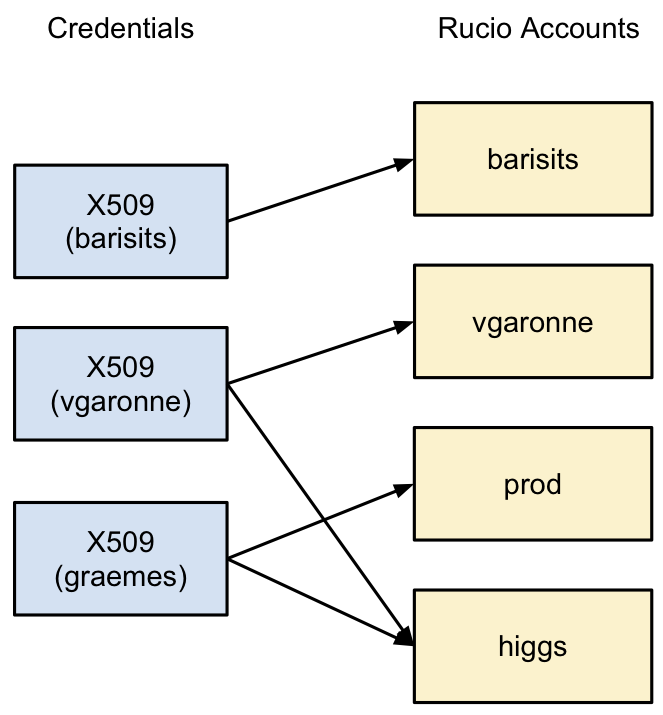

-------------
Rucio account
-------------

A Rucio account is the unit of assigning privileges in Rucio. It can
represent individual users (such as user1, user2, user3, ...), a
group of users (such as group1, group2, group3, ...) or a centralized production
activity such as service accounts for data generation (datagen) or the workflow
management systems (wfms). A Rucio account is identified by a string.

All interactions with Rucio are always conducted by a Rucio account. A Rucio user is authenticated by credentials, such as X509 certificates,
username/password, SSH, or tokens. Credentials can map to one or more
accounts (N:M mapping). The Rucio authentication system checks if the
used credentials are authorized to use the supplied Rucio account.
The figure below gives an example of the mapping between credentials
and Rucio accounts:

