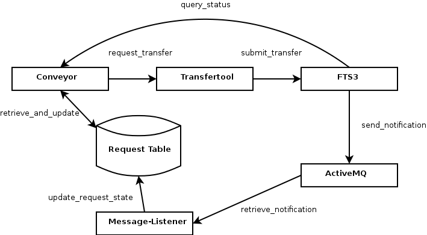

-------------------
Scheduled Transfers
-------------------

There are three components involved with scheduled transfer requests: the conveyor daemon, the transfertool, and the message-listener. The conveyor daemon selects which request should be queued for transfer, and then hands them over to the transfertool. The transfertool implements the binding to a, possibly third-party, service that actually executes the transfer. The message-listener is an optional component that updates the status of the actual transfer within Rucio, if a third-party system sends status update events. If the external system does not send events, then the Conveyor polls instead periodically.

********
Conveyor
********

The conveyor consists of two independent threads, the submitter and the poller. Multiple instances of the conveyor can be started as well.

The submitter retrieves a request from the database, in status QUEUED and with type TRANSFER. It then resolves the currently available source replicas for the request and submits it to a given implementation of the transfertool interface. Currently, only FTS3 as a transfertool is implemented. After submission the submitter continues immediately with the next available request.

The poller retrieves a request of type TRANSFER from the database, which has been in state SUBMITTED since more than, configurable, one hour. Single file transfer should not take longer than this, which most likely means that the notification from the external transfer system was lost. The poller then explicitly queries the external transfer system for the status of the transfer, and resets the appropriate status (SUBMITTED, DONE, FAILED) within Rucio.

************
Transfertool
************

The transfertool implements three actions, submitting a transfer, querying the status of a transfer, and cancelling a transfer. There is currently only one implementation of the transfertool, for the WLCG File Transfer Service 3 (FTS3). It uses the REST API of FTS3 to submit or cancel JSON-encoded transfers, and parses the JSON responses of job status queries.

****************
Message-Listener
****************

The Message-Listener updates the state of the request within Rucio, after receiving ActiveMQ notifications from FTS3. The events are consumed based on an "vo=atlas" selector, so it actually has to consume all transfer state changes, but it will only act when an external state change would result in a Rucio request state change. The Message-Listener is also not a requirement, as the poller in the conveyor will ensure that every request will be processed eventually.
